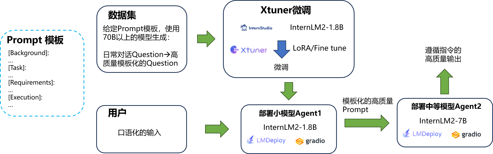

# 项目简介
本项目旨在开发一个基于大小模型协同的LLM的智能对话助手，能够重新组织用户的任意输入问题，提供高质量的回答。

# 项目任务
数据集收集：收集并整理大量高质量的对话数据，以便训练和微调模型。
模型微调：使用Xtuner对预训练模型进行微调，以提高其在特定任务上的表现。
模型部署：将微调后的模型部署为可供用户访问的服务，支持实时对话。
用户交互：设计用户友好的界面，方便用户与模型进行对话，并输出高质量的回答。

# 项目步骤
1. 数据集收集和预处理：收集各类对话数据，并进行清洗和标注。
2. 模型微调：利用Xtuner对InternLM2-1.8B模型进行微调，提升其转换用户口语化输入的正确性。
3. 模型部署：使用Gradio将微调后的模型部署为web服务，支持用户实时访问。
4. 用户交互测试：通过用户反馈不断优化系统，提升模型的回答准确性和自然性。
5. 调节Prompt模板：根据用户真实反馈，修改Prompt模板，使其更符合用户需求，提高对话质量。

